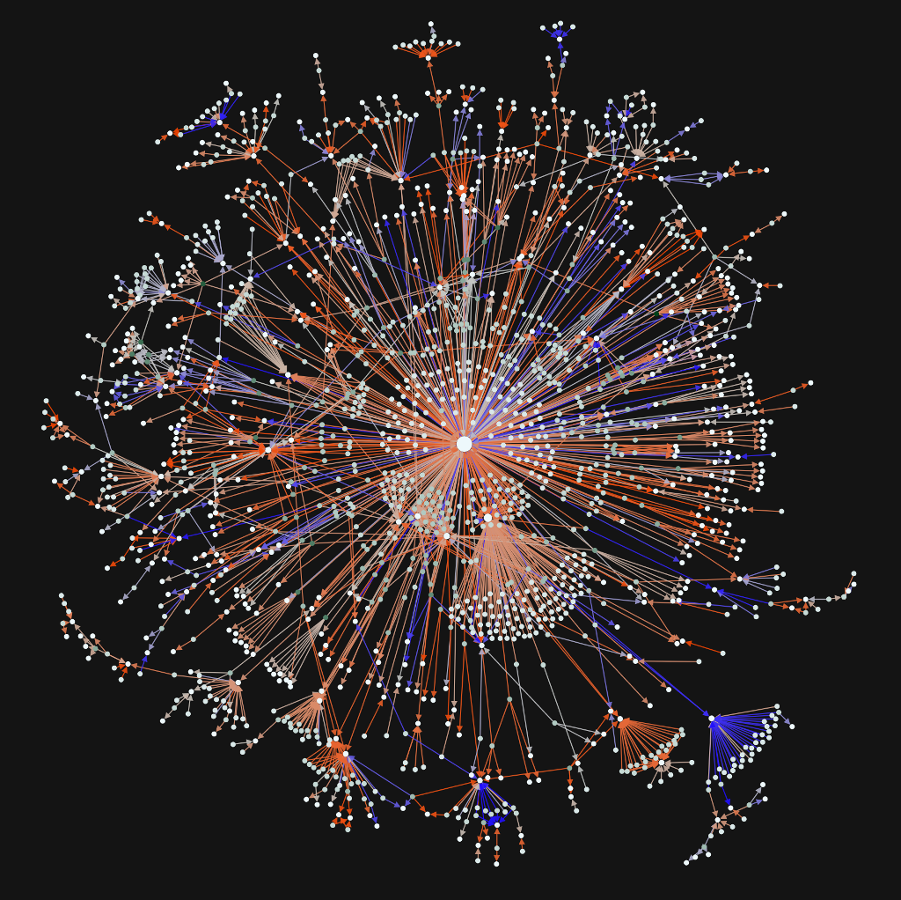

# Lesson on Twitter Social Network and Sentiment Analysis

This is an interactive introductory lesson that covers the following topics:

1. Very short introduction to [Python](https://www.python.org/)/[Jupyter](http://jupyter.org/)/[NumPy](http://www.numpy.org/) and [matplotlib](https://matplotlib.org/),
2. Tweet collection using the Twitter Streaming API (using [tweepy](http://www.tweepy.org/)),
3. Creation and analysis of the network of interactions between Twitter users (using [networkx](https://networkx.github.io/)),
4. Basics of supervised machine learning classification,
5. Sentiment analysis applied to the Twitter interaction network (using [scikit-learn](http://scikit-learn.org/) and [NLTK](http://www.nltk.org/)).

I made it using [Jupyter notebooks](http://jupyter.org/). You can see it directly on github or download the files and run them on your machine.
You need to have python3 installed with [Anaconda](https://www.continuum.io/downloads).

And here is what you should get at the end:

http://alexbovet.github.io/
